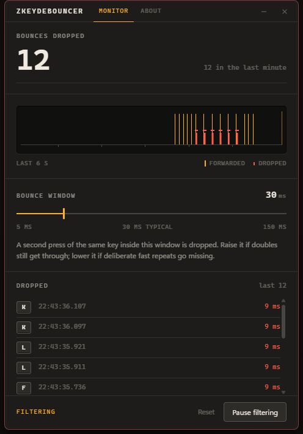
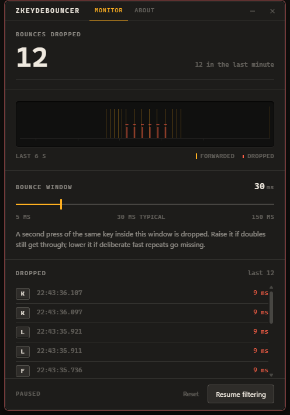
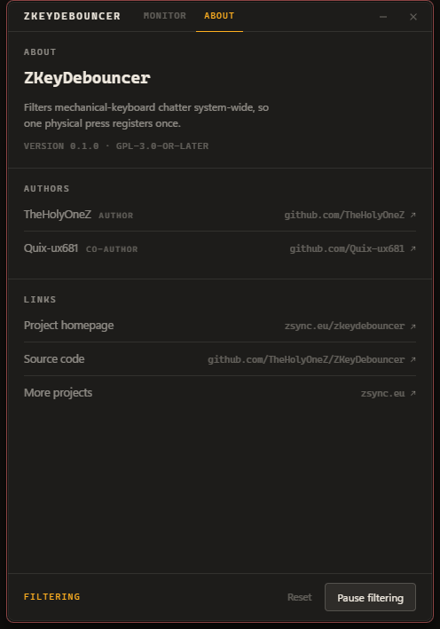

<div align="center">


# ZKeyDebouncer

**Your keyboard types `helllo`. This fixes it.**

A system-wide filter for mechanical-keyboard chatter, so one physical press
registers exactly once.

<a href="https://github.com/TheHolyOneZ/ZKeyDebouncer/releases"></a>


<br>



</div>

---

## The problem

Mechanical keyboard switches wear out. When they do, the metal contact inside
**bounces** on a single press — it makes and breaks contact several times in a
few thousandths of a second. Your computer has no way to know that was one
finger, so it faithfully types every one of them.

You get `helllo` instead of `hello`. You get `  ` instead of ` `. It gets worse
over time, it's maddening to proofread around, and it usually hits one or two
specific keys long before the rest of the board is worn out.

**ZKeyDebouncer fixes it in software.** It watches every key press before any
application sees it, and when the same key fires again impossibly fast, it
throws that press away. The keystroke never reaches Windows, your text editor,
your game, or anything else.

You do not need a new keyboard.

---

## Screens

<table>
<tr>
<td width="50%" valign="top">


**Monitor** — the running count, a live trace of the last six seconds, the
threshold control, and a log of exactly which keys were dropped and how fast
they bounced.

</td>
<td width="50%" valign="top">



**Paused** — filtering suspended. The trace dims and the status reads `PAUSED`,
so it is never ambiguous whether the filter is doing anything.

</td>
</tr>
<tr>
<td width="50%" valign="top">



**About** — version, license, and links to the project and its authors.

</td>
<td width="50%" valign="top">

**Reading the trace**

Every key press is plotted right to left over six seconds.

- A **tall amber bar** is a press that was forwarded normally.
- A **short red stub with a dash above it** is a bounce that was thrown away.

When your keyboard is healthy the lane is all amber. Red stubs appearing in
tight clusters next to an amber bar is chatter, caught.

</td>
</tr>
</table>

---

## Install

1. Download `ZKeyDebouncer_0.1.0_x64-setup.exe` (or the `.msi`) from
   [Releases](https://github.com/TheHolyOneZ/ZKeyDebouncer/releases).
2. Run it. Windows SmartScreen may warn that the publisher is unknown, because
   the build is not code-signed — choose **More info → Run anyway**.
3. Launch **ZKeyDebouncer**. It starts filtering immediately.

There is nothing to configure to get the default behaviour. Leave it running in
the background and type normally.

> [!NOTE]
> ZKeyDebouncer needs to be running to filter anything. It does not install a
> driver or a background service, and it does not start with Windows unless you
> add it to your startup folder yourself.

---

## Using it

### Bounce window

The one setting that matters. It is the span after you release a key during
which a second press of **that same key** is treated as chatter rather than as
something you meant.

| If you see | Do this |
| --- | --- |
| Doubled letters still getting through | **Raise** the window, in small steps |
| Your deliberate fast double-taps going missing | **Lower** the window |
| Nothing obviously wrong | Leave it at **30 ms** |

Most worn switches bounce within 10–25 ms, which is why the default sits at
30 ms. Very few people can deliberately press the same key twice in under
50 ms, so there is a wide margin between "chatter" and "on purpose".

Changes apply instantly. There is no save button and nothing to restart.

### Dropped log

Each row is one keystroke that was thrown away: the key, the time to the
millisecond, and the **gap** — how long after the previous release it fired.
Gaps in the single digits are unmistakable chatter. Gaps near your threshold
are worth a second look, and are the signal that you should lower the window.

This is also how you identify a failing switch: if the same key keeps appearing,
that is the one that is worn.

### Pause filtering

Stops the filter without closing the app, so you can compare directly. Useful
for confirming that a doubling problem is really your keyboard and not the
application you are typing into.

---

## Does it actually block the keystroke?

Yes — the press is destroyed, not merely counted.

When a press is judged to be chatter, the hook returns `1` instead of passing
the event along the chain. Windows then discards it, so no application ever
receives it. The matching release is discarded too, so the system never sees a
key go up that it never saw go down.

Measured by injecting synthetic press/release pairs into a focused text field,
with the window at its 30 ms default:

| Case | Gap between release and next press | Presses sent | Characters that landed |
| --- | --- | --- | --- |
| **Chatter** | 8–9 ms (inside the window) | 30 | **10** |
| **Real repeats** | 60 ms (outside the window) | 30 | **30** |

Ten bursts of three presses each. Every burst's first press went through and all
twenty bounces were swallowed, while identical presses spaced beyond the window
were left completely alone. No legitimate keystroke was lost.

---

## Privacy

**What you type never leaves the hook.**

- A key's *identity* is reported to the window only for presses that are
  **dropped** — that is the point of the log.
- Everything you actually type is forwarded and counted as an anonymous tick,
  with no key identity attached.
- Nothing is written to disk. Nothing is sent anywhere. There is no telemetry,
  no update check, and no network code in the application at all.
- The dropped log lives in memory, holds the last 60 entries, and disappears
  when you close the app.

---

## How it works

```
 physical key ──► Windows raw input ──► ZKeyDebouncer hook ──► every other app
                                              │
                                       is this a bounce?
                                        │            │
                                       no           yes
                                        │            │
                                   forward it     destroy it
                                        │            │
                                        └──► mpsc ───┘
                                              │
                                     forwarder thread ──► the window
```

The rule is narrower than "ignore repeats", on purpose. A press counts as
chatter only when the key was **released** less than the bounce window ago.
Filtering on time-since-last-press instead would swallow the operating system's
key auto-repeat, and holding a key down would break. Each key is tracked
independently, so fast alternating typing is never affected.

`src-tauri/src/debounce.rs` holds that rule on its own, free of any hook or GUI
types, with unit tests covering clean presses, bounces, auto-repeat, independent
keys, and repeated bounce trains.

<details>
<summary><b>Why the hook supervises itself</b></summary>

<br>

Windows silently removes a low-level keyboard hook whose callback overruns
`LowLevelHooksTimeout`. It raises no error — the hook simply stops being called,
and a program parked waiting for events will wait forever without ever learning
that filtering has stopped. A busy machine is enough to trigger it.

So the hook is not installed and forgotten. A watchdog injects a reserved key
every few seconds and confirms the callback saw it. If several checks in a row
come back missing, the hook is torn down and reinstalled. That also puts
ZKeyDebouncer back at the head of the hook chain, ahead of any other program
that installed one after it.

The probe key is `VK_F24`. It needs a real scan code — a virtual key without one
is discarded before any hook sees it, which would make a perfectly healthy hook
look dead. F24 exists on almost no physical keyboard and is bound by almost
nothing, and the callback swallows it, so it never reaches an application.

The callback itself stays deliberately cheap: one uncontended mutex, three
relaxed atomic reads, and a non-blocking channel send. All reporting happens on
a separate thread, so a busy window can never add latency to a keystroke — and
nothing slow may ever be added to that path, or Windows will quietly drop the
hook again.

</details>

---

## Building from source

Requires [Rust](https://rustup.rs), [Node](https://nodejs.org) 18+, and
[pnpm](https://pnpm.io).

```bash
pnpm install          # JavaScript dependencies
pnpm tauri dev        # run with hot reload
pnpm tauri build      # installers in src-tauri/target/release/bundle
```

Backend tests:

```bash
cd src-tauri && cargo test
```

### Platform support

| Platform | Backend | Status |
| --- | --- | --- |
| **Windows 10 / 11** | Native `WH_KEYBOARD_LL` hook, supervised | Supported and tested |
| macOS | `rdev` | Builds; needs Accessibility permission. Untested |
| Linux | `rdev` | Builds; X11 only, needs `/dev/input` access. Untested |

On Windows it runs as a normal user. It cannot filter input to windows running
elevated — start it as administrator if you need that.

---

## Authors

| | | |
| --- | --- | --- |
| **TheHolyOneZ** | Author | [github.com/TheHolyOneZ](https://github.com/TheHolyOneZ) |
| **Quix-ux681** | Co-author | [github.com/Quix-ux681](https://github.com/Quix-ux681) |

- **Project homepage** — [zsync.eu/zkeydebouncer](https://zsync.eu/zkeydebouncer/)
- **More projects** — [zsync.eu](https://zsync.eu/)
- **Source** — [github.com/TheHolyOneZ/ZKeyDebouncer](https://github.com/TheHolyOneZ/ZKeyDebouncer)

---

## License

GPL-3.0-or-later. See [LICENSE](LICENSE).
